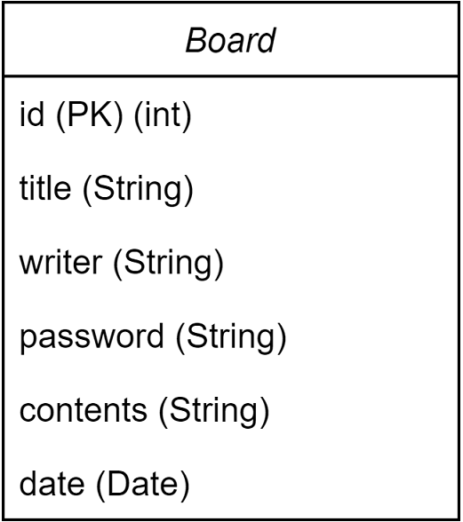

# Notice-Board
익명 게시판 만들기
# 개발기간
2023-11-03~
# 구현할 기능
- [x] 게시글 작성 기능
- [x] 게시글 목록 조회 기능
- [x] 선택한 게시글 조회 기능
- [x] 게시글 수정 기능
- [x] 게시글 삭제 기능
# Use Case Diagram

# ERD

# API
|기능|Method| URL             | request                                                                   | response    |
|:------|:---|:----------------|:--------------------------------------------------------------------------|:------------|
|게시글 작성|POST| /api/board | {'title':title, 'writer':writer, 'password': password, 'content':content} | 등록된 게시글의 정보 |
|게시글 목록 조회|GET| /api/board |                                                                           | 등록된 글들의 정보  |
|게시글 조회|GET| /api/board/{id} |                                                                           | 선택된 글의 정보   |
|게시글 수정|PUT| /api/board/{id} | {'title':title, 'writer':writer, 'password': password, 'content':content} | 수정된 게시글의 정보 |
|게시글 삭제|DELETE| /api/board/{id} | ?id = {id}                                                                |             |
